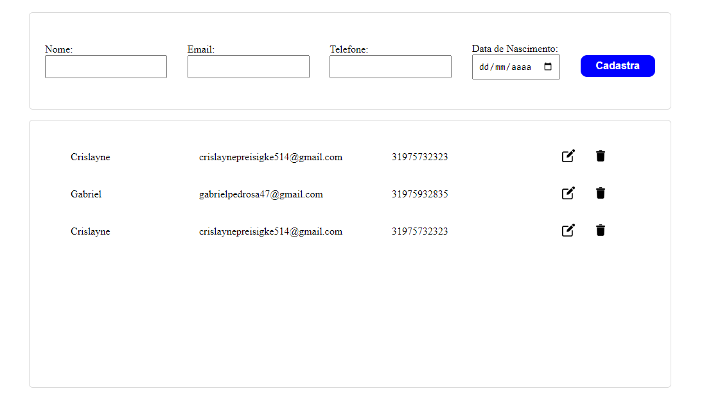

<h1>Crud User</h1>

    Esse e um crud que adicionamos novos usuários, que é enviado para nosso banco de dados e fazemos nossa requisição  
    via api e adicionamos nosso novo usuario a lista de usuários na nossa tela.
    Também podemos altera os dados do nosso usuários caso algo esteja errado.
    E podemos excluir usuários na lista 

## Tecnologia utilizada

- React
- Node
- Next
- Css Modules
- Mysql
- Axios